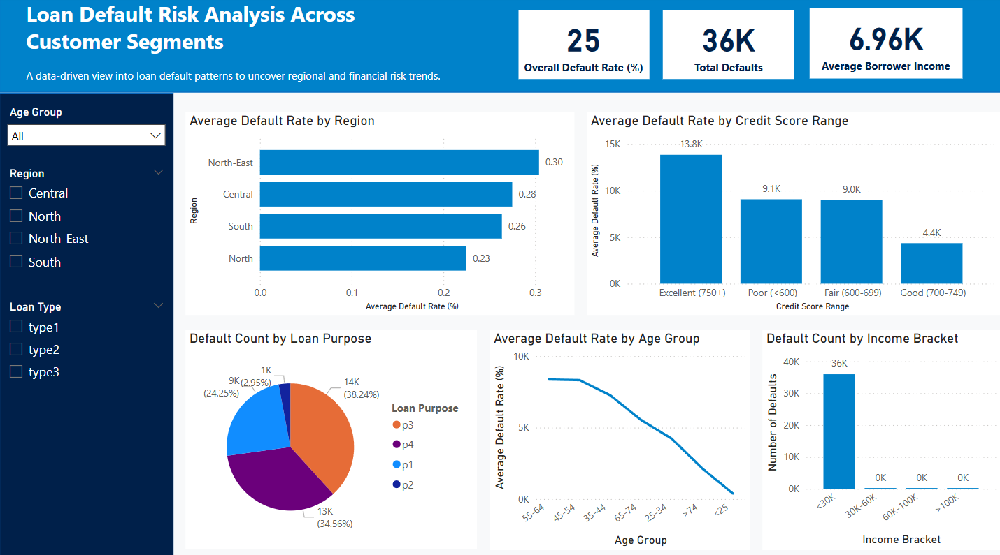

# Loan Default Risk Analysis (SQL + Power BI)

This project uses SQL and Power BI to explore, analyze, and visualize **loan default risk patterns** based on a real-world dataset. The insights generated help in understanding post-loan issuance risk – a key area in banking analytics and credit risk teams.

## Business Problem
Analyze loan default risks using post-issuance loan data and generate actionable insights for risk teams in financial institutions.

# Dashboard

## Key Insights
- Higher default rates are observed in certain regions and loan purposes.
- Lower income brackets are associated with increased default probability.
- Certain age groups and loan types show distinct patterns in risk behavior.

## Tech Stack
- SQL (MySQL): Data Exploration, and querying
- Power BI: Visualization and storytelling
- Excel: Initial data preprocessing and cleaning

## Key Features
- Region-wise and demographic breakdown of defaults
- KPI cards ( Defaults, Avg. Borrower Income, Default Rate)
- Filters/slicers for dynamic exploration

Connect with me on [LinkedIn](https://www.linkedin.com/in/saloni-r/)
